# MediSistema - Consultas SQL

## Información del estudiante

- **Nombre:** Juan David Arias Patiño
- **Asignatura:** Bases de Datos
- **Motor de Base de Datos:** MySQL
- **Sistema Operativo:** macOS

---

# Descripción del proyecto

**MediSistema** es una base de datos relacional diseñada para gestionar la información de un centro médico. El sistema permite administrar médicos, empleados, pacientes, vacaciones, sustituciones y consultas médicas, garantizando la integridad de la información mediante el uso de claves primarias y foráneas.

Como parte del desarrollo del proyecto se implementó un conjunto de consultas SQL que permiten obtener información estadística y administrativa utilizando funciones de agregación, agrupamiento, filtros y relaciones entre tablas.

---

# Modelo lógico

A continuación se presenta el modelo lógico de la base de datos implementada.

    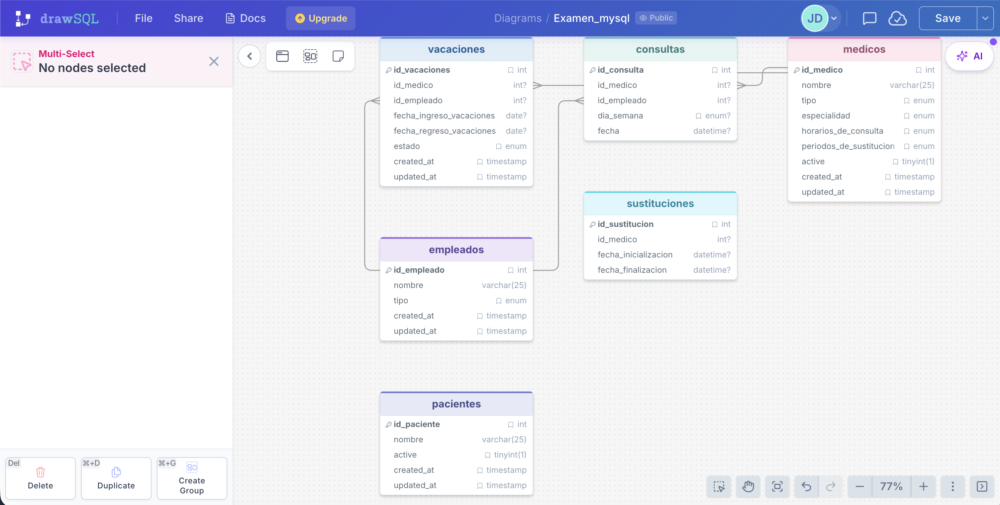

---

# Evidencias de las consultas

## Consulta 1. Número de pacientes atendidos por cada médico

    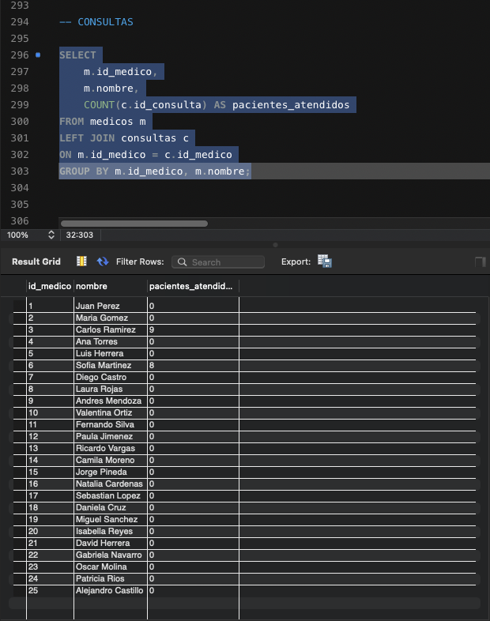

---

## Consulta 2. Total de días de vacaciones planificadas y disfrutadas por cada empleado

    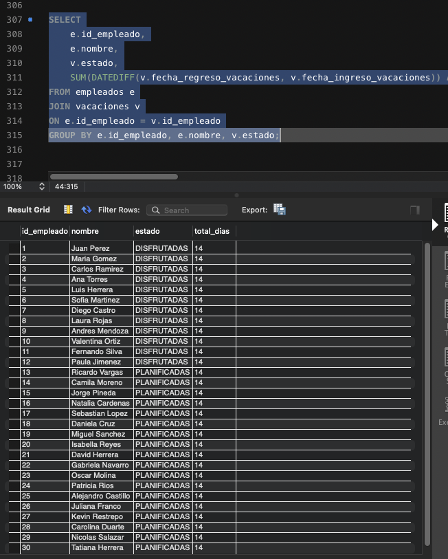

---

## Consulta 3. Médicos con mayor cantidad de horas de consulta en la semana

    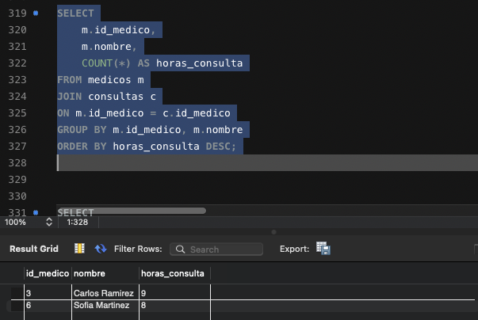

---

## Consulta 4. Número de sustituciones realizadas por cada médico sustituto

    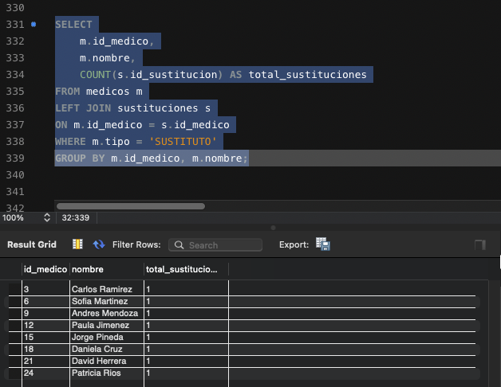

---

## Consulta 5. Número de médicos que están actualmente en sustitución

    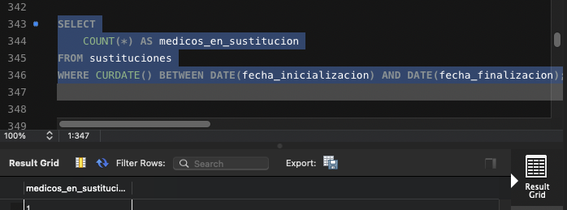

---

## Consulta 6. Horas totales de consulta por médico por día de la semana

    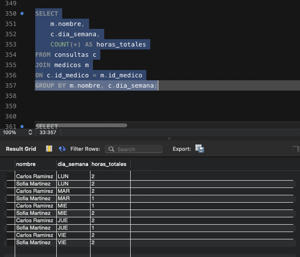

---

## Consulta 7. Médico con mayor cantidad de pacientes asignados

    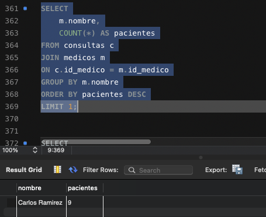

---

## Consulta 8. Empleados con más de 10 días de vacaciones disfrutadas

    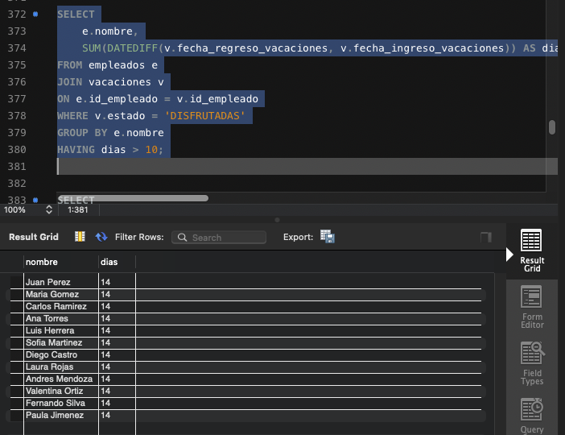

---

## Consulta 9. Médicos que actualmente están realizando una sustitución

    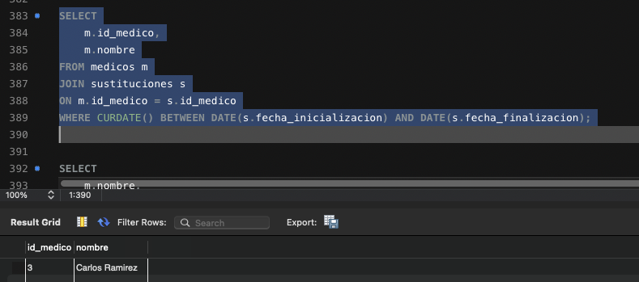

---

## Consulta 10. Promedio de horas de consulta por médico por día de la semana

    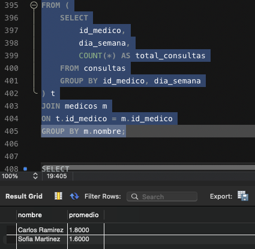

---

## Consulta 12. Médicos con más de 5 pacientes y total de horas de consulta en la semana

    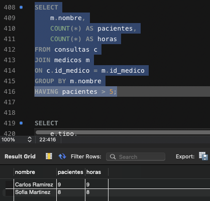

---

## Consulta 13. Total de días de vacaciones planificadas y disfrutadas por cada tipo de empleado

    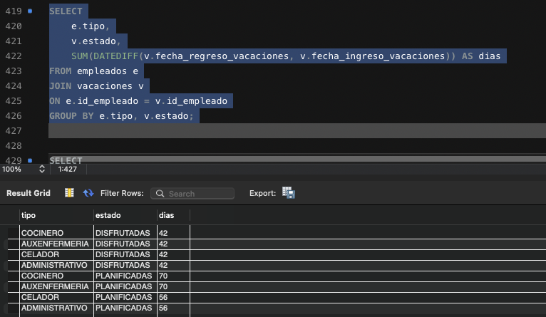

---

## Consulta 14. Total de pacientes por cada tipo de médico

    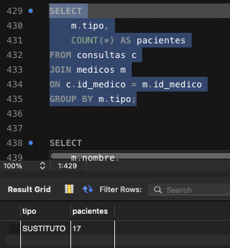

---

## Consulta 15. Total de horas de consulta por médico y día de la semana

    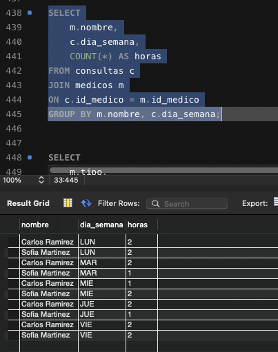

---

## Consulta 16. Número de sustituciones por tipo de médico

    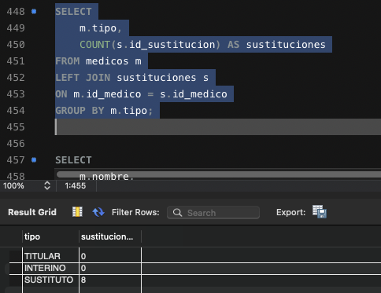

---

## Consulta 17. Total de pacientes por médico y por especialidad

    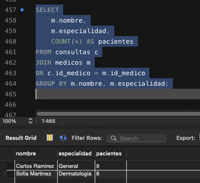

---

## Consulta 18. Empleados y médicos con más de 20 días de vacaciones planificadas

    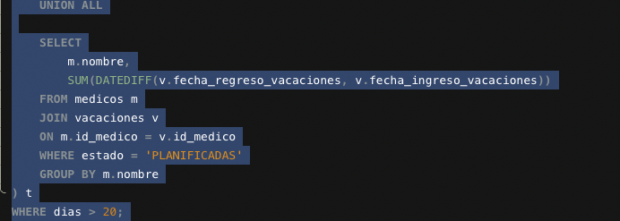

---

## Consulta 19. Médicos con el mayor número de pacientes actualmente en sustitución

    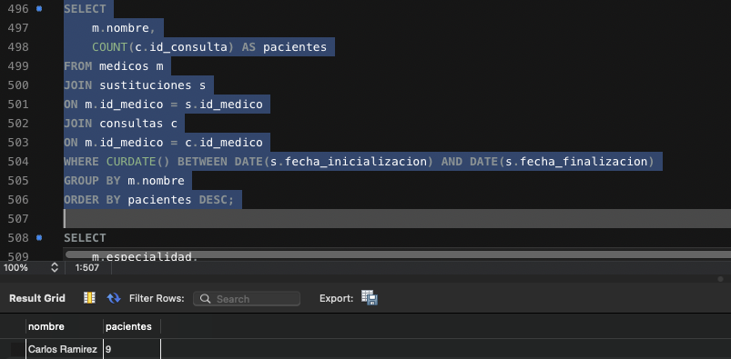

---

## Consulta 20. Total de horas de consulta por especialidad y día de la semana

    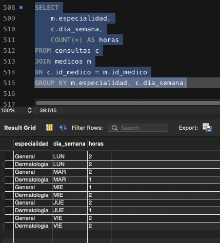

---

# Tecnologías utilizadas

- MySQL
- SQL
- MySQL Workbench
- Git
- GitHub

---

# Conclusiones

- Se diseñó e implementó una base de datos relacional para la gestión de información de un centro médico utilizando MySQL.
- Se aplicaron conceptos fundamentales del modelo relacional, incluyendo claves primarias, claves foráneas y restricciones para mantener la integridad de los datos.
- Se desarrollaron consultas SQL empleando funciones de agregación como `COUNT()`, `SUM()`, `AVG()` y `DATEDIFF()`, además de operaciones de agrupamiento mediante `GROUP BY` y filtros con `HAVING`.
- Las consultas permitieron obtener información relevante sobre la gestión de médicos, empleados, vacaciones, sustituciones y consultas médicas.
- El proyecto fortaleció el manejo de consultas de complejidad media, el uso de relaciones entre tablas y el análisis de información mediante SQL.